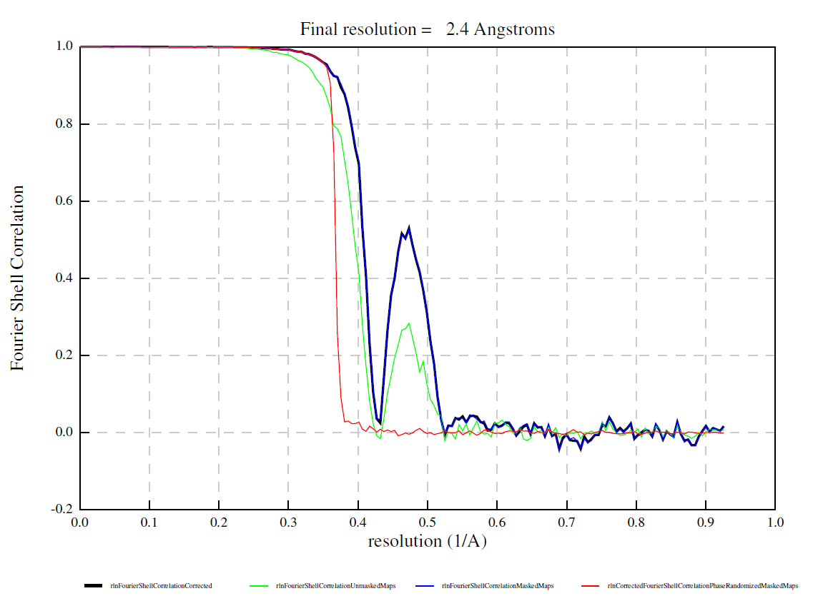
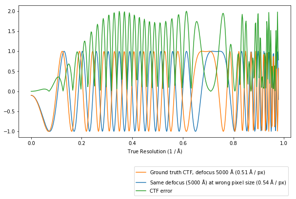
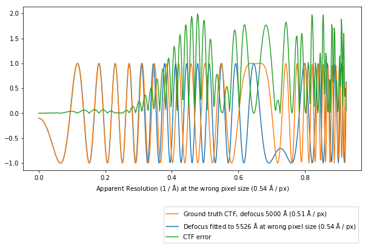
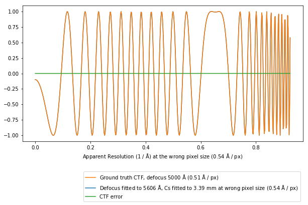

Pixel size issues
=================

What should I do if the pixel size turned out to be wrong?
----------------------------------------------------------

If the error is small (say 1-2 %) and the resolution is not very high (3 Å), you can specify the correct pixel size in the PostProcess job.
This scales the resolution in the FSC curve.
When the error is large, the presence of spherical aberration invalidates this approach.
Continue reading.

.. warning::
    You **should not** edit your STAR files because your current defocus values are fitted against the initial, slightly wrong pixel size.
    Also, you **should not** use "Manually set pixel size" in the Extraction job.
    It will make metadata inconsistent and break Bayesian Polishing.
    Thus, this option was removed in RELION 3.1.

Cs and the error in the pixel size
----------------------------------

Recall that the phase shift due to defocus is proportional to the square of the wave number (i.e. inverse resolution), while that due to spherical aberration is proportional to the forth power of the wave number.
At lower resolutions, the defocus term dominates and errors in the pixel size (i.e.
errors in the wave number) can be absorbed into the defocus value fitted at the nominal pixel size.
At higher resolution, however, the Cs term becomes significant.
Since Cs is not fitted but given at the correct pixel size, the error persists.
As the two terms have the opposite sign, the errors sometimes cancel out at certain resolution shells, leading to a strange bump in the FSC curve.
See an example below contributed from a user.
Here the pixel size was off by about 6 % (truth: 0.51 Å/px, nominal: 0.54 Å/px).

Below is a theoretical consideration.
Let's consider a CTF at defocus 5000 Å, Cs 2.7 mm at 0.51 Å/px.
This is shown in orange.
If one thought the pixel size is 0.54 Å/px, the calculated CTF (blue) became quite off even at 5 Å (0.2).

However, the defocus is fitted (by CtfFind, followed by CtfRefine) at 0.54 Å/px, the nominal pixel size.
The defocus became 5526 Å, absorbing the error in the pixel size.
This is shown in blue.
The fit is almost perfect up to about 3.3 Å.
In this region, you can update the pixel size in PostProcess.
Beyond this point, the error from the Cs term starts to appear and the two curves go out of phase.
This is why the FSC drops to zero.
However, the two curves came into phase again at about 1.8 Å (0.55)! This is why the FSC goes up again.

If you refine Cs and defocus simultaneously, the error in the pixel size is completely absorbed and the fit becomes perfect.
Notice that the refined Cs is 3.39, which is 2.7 * (0.54 / 0.51)^4.
Also note that the refined defocus 5606 Å is 5000 * (0.54 / 0.51)^2.

In practice, one just needs to run ``CtfRefine`` twice: first with ``Estimate 4th order aberrations`` to refine Cs, followed by another run for defocus.
Note that ``rlnSphericalAberration`` remains the same.
The error in Cs is expressed in ``rlnEvenZernike``.
You **should never** edit the pixel size in the STAR file!

Now everything is consistent at the nominal pixel size of 0.54 Å/px.
In PostProcess, one should specify 0.51 Å/px to re-scale the resolution and the header of the output map.

How can I merge datasets with different pixel sizes?
----------------------------------------------------

First of all: it is very common that one of your datasets is significantly better (i.e.
thinner ice) than the others and merging many datasets does not improve resolution.
First process datasets individually and then merge the most promising two.
If it improves the resolution, merge the third dataset.
Combining millions of bad particles simply because you have them is a very bad idea and waste of storage and computational time!

For RELION 3.0, please see `an excellent explanation posted to CCPEM by Max Wilkinson <https://www.jiscmail.ac.uk/cgi-bin/webadmin?A2=CCPEM;fd0e7fab.1810>`_.

From RELION 3.1, you can refine particles with different pixel sizes and/or box sizes.
Suppose you want to join two particle STAR files.
First, make sure they have different ``rlnOpticsGroupName``.
For example:

Dataset1.star::

     data_optics
    
    loop_ 
    _rlnOpticsGroup #1 
    _rlnOpticsGroupName #2 
    _rlnAmplitudeContrast #3 
    _rlnSphericalAberration #4 
    _rlnVoltage #5 
    _rlnImagePixelSize #6 
    _rlnMicrographOriginalPixelSize #7 
    _rlnImageSize #8 
    _rlnImageDimensionality #9 
                1  dataset1     0.100000     2.700000   300.000000     1.000000     1.000000          140            2

Dataset2.star::

    data_optics
    
    loop_ 
    _rlnOpticsGroup #1 
    _rlnOpticsGroupName #2 
    _rlnAmplitudeContrast #3 
    _rlnSphericalAberration #4 
    _rlnVoltage #5 
    _rlnImagePixelSize #6 
    _rlnMicrographOriginalPixelSize #7 
    _rlnImageSize #8 
    _rlnImageDimensionality #9 
                1  dataset2     0.100000     2.700000   300.000000     1.100000     1.100000          128            2

Then use JoinStar.
The result should look like::

    data_optics
    
    loop_ 
    _rlnOpticsGroup #1 
    _rlnOpticsGroupName #2 
    _rlnAmplitudeContrast #3 
    _rlnSphericalAberration #4 
    _rlnVoltage #5 
    _rlnImagePixelSize #6 
    _rlnMicrographOriginalPixelSize #7 
    _rlnImageSize #8 
    _rlnImageDimensionality #9 
                1  dataset1     0.100000     2.700000   300.000000     1.000000     1.000000          140            2
                2  dataset2     0.100000     2.700000   300.000000     1.100000     1.100000          128            2

Note that the dataset2's ``rlnOpticsGroup`` has been re-numbered to 2.

If two datasets came from different detectors and/or had very different pixel sizes, you might want to apply MTF correction during refinement.
To do this, add two more columns: ``rlnMtfFileName`` to specify the MTF STAR file (the path is relative to the project directory) and ``rlnMicrographOriginalPixelSize`` to specify the detector pixel size (i.e.
before down-sampling during extraction).

Refine this combined dataset.
For a reference and mask, you must use the pixel size and box size of the first optics group (or use ``--trust_ref_size`` option).
The output pixel size and the box size will be the same as the input reference map.
After refinement, run ``CtfRefine`` with ``Estimate anisotropic magnification: Yes``.
This will refine the **relative** pixel size difference between two datasets.
In the above example, the nominal difference is 10 %, but it might be actually 9.4 %, for example.
Then run Refine3D again.
The **absolute** pixel size of the output can drift a bit.
It needs to be calibrated against atomic models.

For Polishing, do **NOT** merge MotionCorr STAR files.
First, run Polishing on one of the MotionCorr STAR files with ``run_data.star`` that contains all particles.
This will process and write only particles from micrographs present in the given MotionCorr STAR file.
Repeat this for the other MotionCorr STAR files.
Finally, join two ``shiny.star`` files from the two jobs.
The ``--only_group`` option is not the right way to do Polishing on combined datasets.

How can I estimate the absolute pixel size of a map?
----------------------------------------------------

Experimentally and ideally, one can use diffraction from calibration standards.

Computationally, one can compare the map and a refined atomic model.
However, if the model has been refined against the same map, the model might have been biased towards the map.
Also note that bond and angle RMSDs are not always reliable when restraints are too strong.

If you are sure that :math:`Cs_{\mbox{true}}` given by the microscope manufacturer is accurate, which is often the case, AND the acceleration voltage is also accurate, you can optimize the pixel size such that the apparent Cs fitted at the pixel size becomes :math:`Cs_{\mbox{true}}`.

First, find out the :math:`Z_4^0` coefficient.
This is the 7th number in ``rlnEvenZernike``.
The contribution of the spherical aberration to the argument of the CTF's sine function is :math:`1/2 \pi \lambda^3 k^4 Cs`, where k is the wave-number and λ is the relativistic wavelength of the electron (0.0196 Å for 300 kV and 0.0251 Å for 200 kV).
:math:`Z_4^0 = 6k^4 - 6k^2 + 1`.
By comparing the :math:`k^4` term, we find the correction to the Cs is :math:`12 Z_4^0 / (\pi \lambda^3)`.
Note that :math:`-6k^2 + 1` terms are cancelled by the lower-order Zernike coefficients and can be ignored.
Thus,

:math:`Cs_{\mbox{apparent}} = Cs_{\mbox{nominal}} + 12 Z_4^0 * 10^{-7} / (\pi \lambda^3)`.

:math:`10^{-7}` is to convert Cs from Å to mm.
:math:`Cs_{\mbox{nominal}}` is what you used in CTFFIND (e.g. 2.7 mm for Titan and Talos).

The real pixel size can be calculated as :math:`\mbox{nominal_pixel_size} (Cs_{\mbox{true}} / Cs_{\mbox{apparent}})^{1/4}`.

Examples
--------

In RELION 3.1, ``relion_refine`` (Refine3D, Class3D, MultiBody) stretches, shrinks, pads and/or crops input particles so that the output has the same nominal pixel size and the box size as the input reference.
Let's study what happens in various cases.

One optics group
^^^^^^^^^^^^^^^^

Suppose your optics group says 1.00 Å/px.
If the header of your reference also says 1.00 Å/px, particles are used without any stretching or shrinking.
The output remains 1.00 Å/px.

Let's assume that the nominal pixel size of 1.00 Å/px turns out slightly off and the real pixel size is 0.98 Å/px.
As discussed above, you should **never change the pixel size in the optics group table**, since all CTF parameters, coordinates and trajectories are consistent with the nominal pixel size of 1.00 Å/px.
When the header of your reference is 1.00 Å/px, the output map header says 1.00 Å/px, but it is actually 0.98 Å/px.
Thus, you should specify 0.98 Å/px in PostProcess.
The post-processed map will have 0.98 Å/px in the header and the X-axis of the FSC curve will be also consistent with 0.98 Å/px.

You **must not** use this 0.98 Å/px map from PostProcess in future Refine3D/MultiBody/Class3D jobs.
Otherwise, ``relion_refine`` stretches nominal 1.00 Å/px particles into 0.98 Å/px.
Thus, the output map will have the nominal pixel size of 0.98 Å/px but the actual pixel size will be 0.98 * 0.98 / 1.00 = 0.96 Å/px!

Multiple optics groups
^^^^^^^^^^^^^^^^^^^^^^

Suppose your have two optics groups, one at 1.00 Å/px and the other at 0.95 Å/px.
If the header of your reference is 1.00 Å/px, the particles in the first group are used without any stretching or shrinking, while those from the second group are shrunk to match 1.00 Å/px.
The output map is at 1.00 Å/px.

Let's assume that the real pixel size of the first group is exactly at 1.00 Å/px, while that of the second group is actually 0.90 Å/px.
After stretching by the ratio between the nominal pixel size and the pixel size in the reference header, the true pixel size for the second group corresponds to 0.90 / 0.95 * 1.00 = 0.947 Å/px.
Thus, the reconstruction is a mixture of particles at 1.00 Å/px and 0.947 Å/px.
Depending on the number and signal-to-noise ratio of particles in each group, *the real pixel size of the output can be any value between 0.947 and 1.00 Å/px*, while the output header says 1.00 Å/px.

Anisotropic magnification refinement in CtfRefine finds the **relative** pixel size differences between particles and the reference.
Suppose the actual pixel size of the output from Refine3D is 0.99 Å/px and there is no anistropic magnification.
CtfRefine finds the particles in the first group look smaller in real space than expected and puts ``0.9900 0 0 0.9900`` in ``rlnMatrix00, 01, 10, 11`` (0.9900 = 0.99 / (1.00 * 1.00 / 1.00)).
The particles in the second group look larger in real space than expected and ``rlnMatrix00`` to ``rlnMatrix11`` will be ``1.045 0 0 1.045`` (= 0.99 / (0.90 / 0.95 * 1.00)).

Notice that these numbers **do not give you the absolute pixel size** (e.g. 0.95 / 1.045 = 0.9091 ≠ 0.900).
However, you can work out the pixel size of the reconstruction and other optics groups if you are confident with the pixel size of one optics group.
You can also work out the pixel size of all optics groups if you calibrate the pixel size of the reconstruction with atomic models.
Carefully follows two streching/shrinking steps done in ``relion_refine``: one to match the nominal pixel size of an optics group to the nominal pixel size of the reference and the further correction by ``rlnMatrix``.