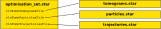

.. _sec_sta_optimisation_set:

Optimisation set
================

The optimisation set is the central data type in a |RELION| tomography project, and it only contains paths to other files.
It is usually named ``optimisation_set.star``.

Specifically, it can point to the following data files:

- A |tomogram_set| listing all tomograms.
- A |particle_set| listing all particles.
- A |trajectory_set| describing the motion of all particles.

All of those entries are optional, and different programs require different inputs.
All programs take an optimisation set as input, and most of them also write one out.
If a data file is created or updated by a program, it is added to the optimisation set that the program writes out.
This frees the user from having to track which programs update which data files.
For example, :ref:`program_tomo_refine_ctf` will only update the |tomogram_set|, because the defoci are only defined once for each tilt image, while :ref:`program_tomo_align` will update the |tomogram_set|, the |particle_set| and the |trajectory_set|.
		
When running a program, the individual data files can also be specified separately, in which case the individual files will override the ones listed in the optimisation set.
This allows the user to easily perform the same procedure with specific data files exchanged.
If all data files required by a program have been specified individually, then an optimisation set is not required at all.

There are 3 ways to create an initial optimisation set:

- Use the utility program :ref:`program_tomo_make_optimisation_set`.
- Run any program and specify the individual data files. The program will then output a new optimisation set.
- Write one manually.

.. |particle_set| replace:: :ref:`particle set <sec_sta_particle_set>`
.. |tomogram_set| replace:: :ref:`tomogram set <sec_sta_tomogram_set>`
.. |trajectory_set| replace:: :ref:`trajectory set <sec_sta_trajectory_set>`
.. |nbsp| unicode:: 0xA0
