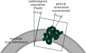

.. _sec_sta_particle_set:

Particle set
============

The particle set (typically named ``particles.star``) lists all the particles in a data set.
It is roughly equivalent to the corresponding particles file used by the SPA programs in |RELION|, and it serves as the binding element between the tomography programs and the ones used for the general refinement.

Like an SPA particle set, the tomography particle set consists of an optics table and a particles table.
Unlike in an SPA particle set, the coordinates of the particles are given in 3 dimensions (``rlnCenteredCoordinate<X/Y/Z>Angst`` and ``rlnOrigin<X/Y/Z>Angst``), and each particle also requires a tomogram name (``rlnTomoName``) that identifies the particle's tomogram of origin, as defined in the |tomogram_set|. Note that in Relion 5, the pixel coordinates ``rlnCoordinate<X/Y/Z>`` have been replaced by the absolute and centered coordinates ``rlnCenteredCoordinate<X/Y/Z>Angst``, which are in Angstroms from the centre of the tomogram.

Also unlike in SPA, the tomography particles should not be thought of as pixel data stored on disk, but instead as abstract entities defined in this file. They are represented on the disk either as 2D stacks of CTF-premultiplied extracted images (the preferred way in Relion 5) or as 3D volumes where Fourier slices of the 2D images are combined in 3D.
The particles that are used for refinement (i.e. the pseudo-subtomograms) can be created using the program :ref:`program_tomo_subtomo`, but they should be regarded as transient data that become invalid once any of the other properties of their tomograms have been updated.
Therefore, during the processing of a tomography data set, the pseudo-subtomograms are typically created multiple times.

Another difference to a SPA 2D particle set is that tomography particles can optionally possess two different orientations.
In tomography, the approximate orientation of a particle is often dictated by the geometric context (e.g. the orientation of a membrane in which they are embedded).
Therefore, the subtomogram alignment can be greatly accelerated by defining the initial orientation of each subtomogram in relation to that geometry (using the fields ``rlnTomoSubtomogram<Rot/Tilt/Psi>``) and then applying strong priors during refinement to constrain the angles that describe the orientation of the particle itself with respect to its subtomogram (``rlnAngle<Rot/Tilt/Psi>``).
Since only the latter angles are considered by ``relion_refine``, the priors will only affect those angles. Typically, this means that the ``rlnAngleTilt`` angle will be constrained, while the other two are usually unknown, even in tomography.

[TODO BOGDAN: does this paragraph still apply?]
There are currently two ways in which a new particle set can be created: it can be either imported from an existing data set, or the particles can be sampled along a set of user-defined (and possibly fitted) :ref:`manifolds <sec_sta_manifold_set>` using the program :ref:`program_tomo_sample_manifold`.
In the latter case, the program will automatically define the subtomogram orientations in relation to the manifold, such that the Z axis of the (yet to be created) subtomograms will point perpendicularly to the manifold.
A more detailed description on how to import particles from existing data sets is provided in :ref:`program_tomo_import_particles`.

.. |tomogram_set| replace:: :ref:`tomogram set <sec_sta_tomogram_set>`
